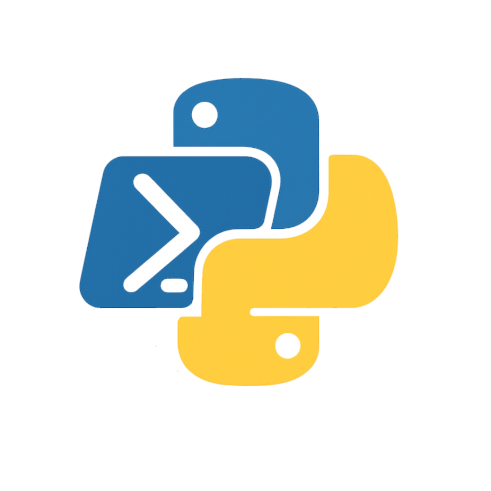
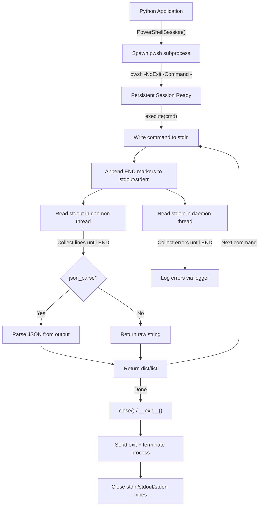
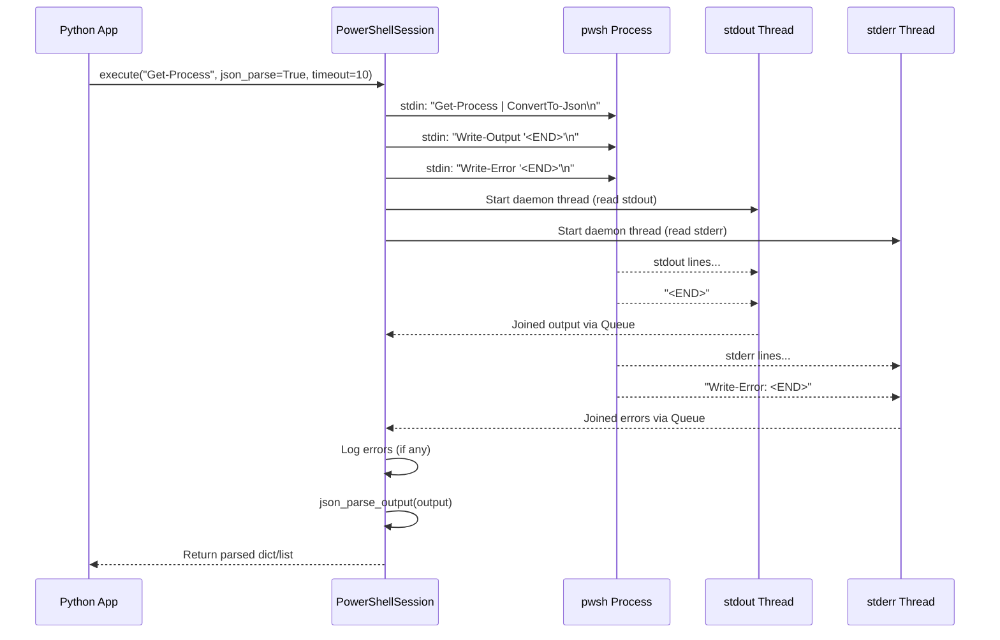
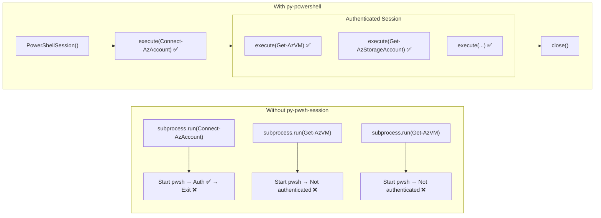

<div align="center">
  

  <h1>py-pwsh-session</h1>

  <p><em>Python module to manage persistent PowerShell sessions, with support for command execution, JSON result parsing, and secure error handling.</em></p>
</div>

---

**py-pwsh-session** is a modern, lightweight Python wrapper that provides seamless integration with PowerShell sessions. Built for developers who need reliable, persistent PowerShell automation in their Python applications.

## Key Features

- **Persistent Sessions** - Maintain long-running PowerShell sessions for faster execution and stateful operations
- **Persistent Authentication** - Stay logged in to PowerShell modules and tools across multiple commands
- **Secure by Design** - Built-in input sanitization prevents command injection attacks
- **Asynchronous Processing** - Non-blocking command execution with configurable timeout handling
- **Clean Output** - Automatic removal of ANSI escape sequences for parseable results
- **JSON Support** - Native JSON parsing from PowerShell `ConvertTo-Json` output
- **Rich Logging** - Automatic error logging from PowerShell stderr during command execution

## How It Works

### Connection Lifecycle

The following diagram shows how `py-pwsh-session` manages the full lifecycle of a PowerShell session, from initialization to cleanup:



### Command Execution Flow

Each call to `execute()` follows this sequence internally:



### Persistent Sessions: Why They Matter

Unlike running individual `subprocess.run(["pwsh", "-Command", "..."])` calls, `py-pwsh-session` keeps a **single PowerShell process alive** across multiple commands.

This is critical when working with **Microsoft PowerShell modules** (Azure, Exchange Online, Microsoft Graph, etc.) that require authentication. With individual subprocess calls, each command spawns a new `pwsh` process that dies immediately after execution — the authenticated session dies with it, making it impossible to run follow-up queries. With `py-pwsh-session`, you authenticate once and the session stays alive, so all subsequent commands run in the same authenticated context.



| Aspect | `subprocess.run()` per command | `py-pwsh-session` session |
|---|---|---|
| Process startup | Every command | Once |
| Authentication | Lost after each command | Persists across commands |
| Variables/state | Lost between calls | Preserved |
| Module queries | Fail (no auth context) | Work (same session) |
| Performance | Slow (process spawn overhead) | Fast (reuse open process) |

## Requirements

- **Python 3.10+**
- **PowerShell Core (pwsh)** - Must be installed and available in PATH
- **Operating System**: Windows, macOS, or Linux with PowerShell Core

### Installing PowerShell Core

**Windows:**
```powershell
winget install Microsoft.PowerShell
```

**macOS:**
```bash
brew install powershell
```

**Linux (Ubuntu/Debian):**
```bash
sudo apt update
sudo apt install -y powershell
```

## Quick Start

### Installation

```bash
pip install py-pwsh-session
```

### Basic Usage

```python
from py_powershell import PowerShellSession

# Create a persistent PowerShell session
pwsh = PowerShellSession()

# Execute a simple command (returns raw string)
result = pwsh.execute("Get-Process | Select-Object -First 5")
print(result)

# Execute with JSON parsing and custom timeout
data = pwsh.execute("Get-Service | Select-Object -First 3", json_parse=True, timeout=15)
print(data)  # Returns a Python dict/list

# Always close the session when done
pwsh.close()
```

### Context Manager (Recommended)

The context manager ensures the session is always properly closed, even if an exception occurs:

```python
from py_powershell import PowerShellSession

with PowerShellSession() as pwsh:
    services = pwsh.execute("Get-Service", json_parse=True, timeout=20)

    for service in services:
        print(f"Service: {service['Name']} - Status: {service['Status']}")
# Session is automatically closed here
```

## Usage Examples

### Leveraging Session Persistence

Variables, modules, and authentication persist across commands within the same session:

```python
from py_powershell import PowerShellSession

with PowerShellSession() as pwsh:
    # Set a variable in the session
    pwsh.execute("$myList = @()")

    # Accumulate data across multiple commands — state is preserved
    pwsh.execute("$myList += 'item1'")
    pwsh.execute("$myList += 'item2'")
    pwsh.execute("$myList += 'item3'")

    # Retrieve the accumulated result
    result = pwsh.execute("$myList | ConvertTo-Json", json_parse=True)
    print(result)  # ['item1', 'item2', 'item3']
```

### Cloud Authentication (Azure Example)

Authenticate once, run multiple commands without re-authenticating:

```python
from py_powershell import PowerShellSession

with PowerShellSession() as pwsh:
    # Authenticate once — session stays logged in
    pwsh.execute("Connect-AzAccount", timeout=30)

    # All subsequent commands reuse the authenticated session
    vms = pwsh.execute(
        "Get-AzVM | Select-Object Name, ResourceGroupName, Location",
        json_parse=True,
        timeout=30,
    )
    for vm in vms:
        print(f"VM: {vm['Name']} in {vm['Location']}")

    # No need to re-authenticate
    storage = pwsh.execute(
        "Get-AzStorageAccount | Select-Object StorageAccountName, Location",
        json_parse=True,
        timeout=30,
    )
    for account in storage:
        print(f"Storage: {account['StorageAccountName']}")
```

### Input Sanitization

The `sanitize()` method prevents command injection by filtering unsafe characters:

```python
from py_powershell import PowerShellSession
import os

with PowerShellSession() as pwsh:
    # Sanitize user-provided input before using it in commands
    raw_input = os.environ.get("USER_EMAIL", "")
    safe_input = pwsh.sanitize(raw_input)
    # "user@domain.com; rm -rf /" → "user@domain.com"

    result = pwsh.execute(f"Get-ADUser -Filter {{EmailAddress -eq '{safe_input}'}}", json_parse=True)
```

### JSON Parsing

Use `json_parse=True` to automatically pipe output through `ConvertTo-Json` and parse it into Python objects:

```python
from py_powershell import PowerShellSession

with PowerShellSession() as pwsh:
    # Returns a Python dict/list instead of a raw string
    processes = pwsh.execute(
        "Get-Process | Select-Object Name, Id, CPU -First 5",
        json_parse=True,
    )

    # Work with structured data directly
    for proc in processes:
        print(f"PID {proc['Id']}: {proc['Name']} (CPU: {proc.get('CPU', 'N/A')})")

    # Without json_parse, you get the raw PowerShell text output
    raw = pwsh.execute("Get-Date")
    print(raw)  # "Saturday, March 7, 2026 12:00:00 PM"
```

### Timeout Handling

Configure timeouts per command based on expected execution time:

```python
from py_powershell import PowerShellSession

with PowerShellSession() as pwsh:
    # Quick command — short timeout (default is 10s)
    date = pwsh.execute("Get-Date", timeout=5)

    # Medium operation
    services = pwsh.execute("Get-Service", json_parse=True, timeout=20)

    # Long-running operation (e.g., cloud API calls)
    all_vms = pwsh.execute("Get-AzVM -Status", json_parse=True, timeout=120)

    # If a command exceeds the timeout, an empty string is returned
    # and the session remains usable for subsequent commands
```

### Error Handling and Logging

PowerShell errors are automatically captured from stderr and logged:

```python
import logging
from py_powershell import PowerShellSession

# Configure logging to see PowerShell errors
logging.basicConfig(
    level=logging.INFO,
    format="%(asctime)s - %(name)s - %(levelname)s - %(message)s",
)

with PowerShellSession() as pwsh:
    # If the command produces an error, it's logged automatically
    result = pwsh.execute("Get-NonExistentCommand", timeout=5)
    # Log output: ERROR - py_powershell.powershell_session -
    #   PowerShell error output: The term 'Get-NonExistentCommand' is not recognized...

    if not result:
        print("Command failed — check logs for details")

    # The session is still usable after an error
    date = pwsh.execute("Get-Date")
    print(date)
```

### Extending PowerShellSession

Subclass `PowerShellSession` to add custom initialization or error handling:

```python
from py_powershell import PowerShellSession


class AzurePowerShellSession(PowerShellSession):
    """A session that auto-connects to Azure on init."""

    def __init__(self, subscription_id: str):
        super().__init__()
        self.execute(f"Connect-AzAccount -SubscriptionId '{self.sanitize(subscription_id)}'", timeout=30)

    def _process_error(self, error_result: str) -> None:
        """Custom error handling for Azure-specific errors."""
        if "AuthorizationFailed" in error_result:
            raise PermissionError(f"Azure authorization failed: {error_result}")
        super()._process_error(error_result)


with AzurePowerShellSession("your-subscription-id") as az:
    vms = az.execute("Get-AzVM", json_parse=True, timeout=30)
```

## Architecture

### Class Hierarchy

```
PowerShellSession
├── __init__()          # Spawn persistent pwsh subprocess
├── execute()           # Execute commands with optional JSON parsing
├── read_output()       # Read stdout/stderr with timeout via threads
├── json_parse_output() # Extract and parse JSON from raw output
├── sanitize()          # Filter input to prevent command injection
├── remove_ansi()       # Strip ANSI escape sequences from output
├── _process_error()    # Handle stderr output (overridable)
├── close()             # Send exit, terminate process, close pipes
├── __enter__()         # Context manager entry
└── __exit__()          # Context manager exit with cleanup
```

## Contributing

We welcome contributions! Please submit pull requests or open issues on GitHub.

## Support

- **Documentation**: [Read the full documentation](https://docs.prowler.cloud)
- **Issues**: [Report bugs or request features](https://github.com/prowler-cloud/py-pwsh-session/issues)
- **Discussions**: [Join the community discussions](https://github.com/prowler-cloud/py-pwsh-session/discussions)
